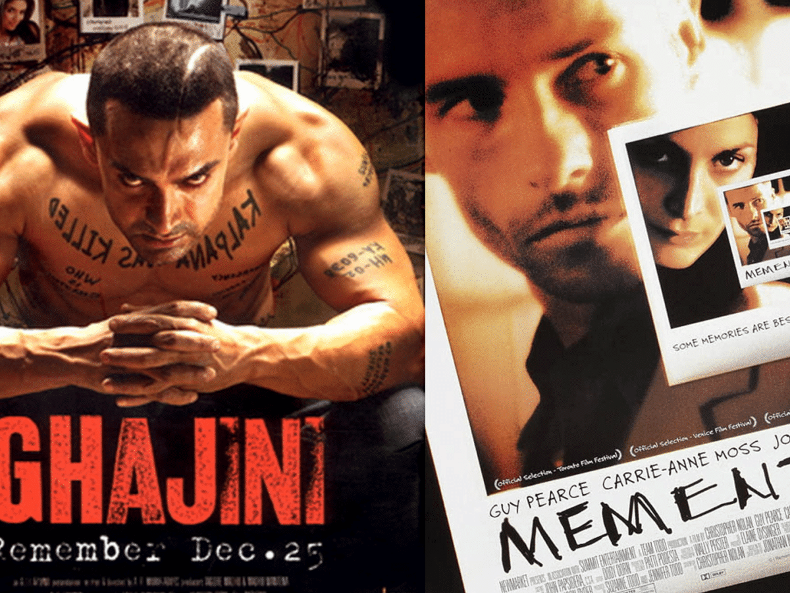
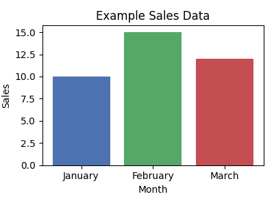

# Ep 1 - ChatGPT Zero to Hero Series

### Remember Ghajini / Memento? 
> **Very powerful yet extremely vulnerable.**
<!-- inserted image -->
{: .center }
<!-- end inserted image -->

## 🎬 The Ghajini Way of ChatGPT Mastery (Joe’s Story)

Meet **Joe**, who runs a small **wellness studio in Bengaluru**. Like in _Ghajini_/_Memento_, Joe learns to beat forgetfulness by building a **system**: clear notes (context), roles, goals, constraints, and reusable workflows. 

For every you’ll get:

- 🎯 **Concept** – what/why
- 💡 **Differentiator** – what makes it powerful
- 🧘 **Try This** – copy‑paste prompts (with/without the when useful)
- 📦 **Self‑contained assets** – mini tables/text you can paste
- 🔑 **Takeaway** – what to remember

> **Q&A → Release pattern** used throughout: Ask ChatGPT to first **ask clarifying questions**, then only **release the final answer** when you reply `GO`.

---

## 🎬 ACT 1 – Forgetfulness to Focus

<a href="https://youtu.be/cOhGaMrw7Vc?si=IuyM0cyMyzITZayZyt=210" target="_blank" rel="noopener noreferrer">
  Watch the this part on YouTube
</a>

### 🧠 Tip 1 — Start with Context (The Ghajini Rule)

**Concept:** Every chat is a blank slate; add scene‑setting.

**Differentiator:** Context turns generic output into _your_ situation.

**Try This (without tip):**

```
Write a post about morning yoga.
```

**Try This (with tip):**

```
I run a small wellness studio in Bengaluru. My audience is busy working professionals (25–40). 
I want a short Instagram post about how morning yoga boosts energy before work — friendly and simple.
Before you write, ask 3 quick questions you need from me. Wait for my answers before writing.
```

**Takeaway:** Context is your first tattoo. 

---

### 🧩 Tip 2 — Define the Role (Give an Identity)

**Concept:** Role changes tone, logic, and focus.

**Differentiator:** Writing _as_ Joe’s coach ≠ writing _for_ Joe.

**Try This:**

```
You are a wellness coach for a neighbourhood yoga studio in Bengaluru.
Ask me up to 3 questions to tailor a 2‑line WhatsApp invite for our “Mindful Morning” session.
Only when I reply GO, release the final message.
```

**Takeaway:** Role = lens.

---

### 🎯 Tip 3 — State the Goal (Define Success)

**Concept:** Tell ChatGPT what “done” looks like.

**Differentiator:** Prevents wandering; improves alignment.

**Try This:**

```
You are a wellness coach.
Goal: Encourage 9–5 professionals to try a 10‑minute morning routine.
Ask me 3 quick questions. After I reply GO, produce a 3‑line Instagram caption.
```

**Takeaway:** Goal = north star.

---

### 🧭 Tip 4 — Add Constraints (Shape the Output)

**Concept:** Boundaries boost clarity.

**Differentiator:** Predictable length/tone/format.

**Try This:**

```
Write a WhatsApp invite for a free meditation class.
Constraints: ≤ 40 words, Hinglish, warm tone, ends with a friendly CTA.
Ask 2 questions first; release final only when I say GO.
```

**Takeaway:** Constraints = discipline.

---

### 🔢 Tip 5 — Ask for Numbered Options (Variety on Demand)

**Concept:** Explore, compare, choose.

**Differentiator:** You see patterns across options.

**Try This:**

```
Give me 3 Instagram hooks for a weekend yoga workshop. Rank by likely engagement. 
Ask 2 questions first; release final options after I say GO.
```

**Takeaway:** Options reveal what “good” looks like.

---

## 🧠 ACT 2 – Remembering the Mission

<a href="https://youtu.be/cOhGaMrw7Vc?si=GoUwvpymx2R4HEWC&t=1176" target="_blank" rel="noopener noreferrer">
  Watch the this part on YouTube
</a>

### 🔁 Tip 6 — Summarize for Reuse (Carry Memory Forward)

**Concept:** Create your own memory.

**Try This:**

```
Summarize this chat in 5 bullets I can paste at the top of our next chat. Use neutral tone.
```

**Takeaway:** Copy summaries into a notes doc.

---

### 📁 Tip 7 — Project Folders (One Thread per Theme)

**Concept:** Organized threads simulate memory.

**Try This:**

```
We’re starting a “Yoga Marketing” project thread. 
Create a reusable header I can paste into future chats with: Audience, Brand voice, Content pillars (Energy • Calm • Community).
Ask me 3 questions to finalize; release the header on GO.
```

**Takeaway:** Folders = focus.

---
---

## 🎨 ACT 3 – Finding Joe’s Voice

<a href="https://youtu.be/cOhGaMrw7Vc?si=z5-Yhm2quGTqN-q3&t=1506)" target="_blank" rel="noopener noreferrer">
  Watch the this part on YouTube
</a>

### 🪄 Tip 8 — Editing in My Voice (Don’t Over‑polish)

**Try This:**

```
Improve this caption but keep my casual voice. 
Keep emojis light. Max 40 words. Ask 1 question; release on GO.

```
when asks for your caption provide this:
```
Just finished another yoga class.
```
**Takeaway:** Preserve Joe’s personality.

### 🎤 Tip 9 — Match Tone by Example

**Try This:**

```
Match the tone of below lines when rewriting my caption :
“Our mornings begin with calm breaths and gratitude — a soft reminder to slow down, connect inward, and welcome the day with ease.”
```

```
Here is my caption: "Radiate positivity, inside and out. Your journey to wellness starts now."
```

**Takeaway:** Examples teach tone faster than adjectives. 

---

### 🎯 Tip 10 — Add Audience Cues

**Try This:**

```
Explain the benefits of yoga to first‑time college students in India — light, friendly, no jargon. 3 sentences.
Ask 1 question; release on GO.
```

**Takeaway:** Audience defines rhythm.

---

### 🧘 Tip 11 — Few‑Shot Prompting (Teach the Pattern)

**Try This:**

```
Example 1: Breathe → Reset your mind.
Example 2: Stretch → Wake your body.
Continue with 3 similar lines. Ask 1 question; release on GO.
```

**Takeaway:** Show, don’t tell.

---

## 📊 ACT 4 – Insights Without Plug‑ins

<a href="https://youtu.be/cOhGaMrw7Vc?si=P69P8brtDzHvGaoO&t=2000)" target="_blank" rel="noopener noreferrer">
  Watch the this part on YouTube
</a>

> Each “data” tip includes a **self‑contained asset** (table) you can paste directly.

### 📈 Tip 12 — Paste Small Tables as Text

**Try This:**

```
Month,Clients
Jan,32
Feb,48
Mar,41
Apr,52

Use the table above. What’s the month‑over‑month trend? Keep to 2 bullets.
```

**Takeaway:** GPT reads small CSVs well.

---

### 🔍 Tip 13 — Ask for Patterns & Anomalies

**Asset:** _(reuse the table above)_

**Try This:**

```
From the clients table, find 2 patterns and 1 anomaly. One‑line explanation each.
```

**Takeaway:** Ask for _analysis_, not summaries.

---

### 🗺️ Tip 14 — Describe Visuals in Words

**Asset:** _(reuse the table above)_

**Try This:**

```
Describe how a bar chart of Month vs Clients would look. Mention tallest/shortest bars and overall shape in ≤ 3 lines.
```

**Takeaway:** Verbal visualization helps non‑designers.

---

### 🗺️ Tip 15 —  Ask for chart descriptions (GPT‑4).

```markdown
Describe this as a bar chart comparing months and sales.
```
<!-- inserted image -->
{: .center }
<!-- end inserted image -->


---
---

## 🗞️ ACT 5 – Power Moves (No Browsing Assumed)

<a href="https://youtu.be/cOhGaMrw7Vc?si=o0pKDKV12_bRgQwW&t=2252)" target="_blank" rel="noopener noreferrer">
  Watch the this part on YouTube
</a>

> Free plans may not browse. These prompts **work even without browsing** by asking for Q&A first and allowing you to paste links if needed.

### 📰 Tip 16 — Latest‑7 day News Miner 

**Concept:** Joe wants a crisp weekly news snapshot.

**Try This:**

```
Curate Content
Topic: Wellness & Yoga in India. Region focus: India. Window: last 7 days.
Output spec:
- 5 bullets max (≤ 20 words each)
- Include source name and date in brackets
- One‑line “Why this matters” at the end
```

**Takeaway:** Structure > length.

---

### 🧩 Tip 17— Structured Data Miner (Newsletter )

**Concept:** Joe wants a crisp weekly news snapshotv.

**Try This:**

````
Curate Content
Topic: Wellness & Yoga in India. Region focus: India. Window: last 7 days.
Output spec:
```
**Headline:** <headline>
**Source / Date:** <source>, <date>
**Link:** <url>
**Quick Summary:** <2 sentences>
**Takeaway:** <short punch-line>
**Discussion topics:** <one bullet, max 20 words>
```
````

**Takeaway:** Turn paste‑ups into insights.

---
### 💾 Tip 18— Create a Prompt Vault (Templates You Re‑use)

**Try This:**

```
Turn my last 5 successful prompts into reusable templates with placeholders like {audience}, {tone}, {length}. Name each template.
```

**Takeaway:** Prompts are assets.

---

### 🧾 Tip 19 — Meeting‑to‑Actions Converter

<a href="https://youtu.be/cOhGaMrw7Vc?si=IMx0hQfnY_NTy5b0&t=2791)" target="_blank" rel="noopener noreferrer">
  Watch the this part on YouTube
</a>


**Try This:**

```
Notes: Plan June promo. Need budget. Assign reels. Book community class venue.

Turn the notes above into action items. Start each with a verb. Group by owner: Joe • Team • Vendor. ≤ 6 bullets.
```

**Takeaway:** Clarity beats clutter.

---

### ✉️ Tip 20— Polite but Assertive Email Rewrite

**Asset (messy email):**

```
hey team, project is behind, pls hurry or we’re in trouble
```

**Try This:**

```
Asset (messy email):
hey team, project is behind, pls hurry or we’re in trouble

Do this:
Rewrite the email to be polite but assertive. Keep it under 70 words. 
```

**Takeaway:** Tone = trust.

---

### 🧾 Tip 21 — Caption Factory (Ranked Options)

**Try This:**

```
Give 5 caption options for International Yoga Day. Rank by clarity. Add 1 hashtag per option. 
```

**Takeaway:** Choice with guidance.

---

### ⚡ Tip 22 — Global Shortcut Commands (Fast Modes)

<a href="https://youtu.be/cOhGaMrw7Vc?si=GC_dTXSavksoeDeu&t=3050)" target="_blank" rel="noopener noreferrer">
  Watch the this part on YouTube
</a>

**Concept:** Quick intents with slash‑style cues.

**Differentiator:** Speed up common tasks. (Use as plain text if your UI doesn’t support `/`.) 

| Slash Cue        | What It Does                       | Example                                                                                                            |
| ---------------- | ---------------------------------- | ------------------------------------------------------------------------------------------------------------------ |
| **`/ELI5`**      | Explain like I’m 5                 | `/ELI5 What is blockchain?`                                                                                        |
| **`/Critique`**  | What’s unclear? 3 fixes.           | `/Critique This email: "Hey, need that file soon pls."`                                                            |
| **`/Bullets`**   | Convert to crisp bullet list.      | `/Bullets Yoga benefits for beginners`                                                                             |
| **`/tl;dr`**     | Too Long; Didn’t Read              | `/tl;dr https://www.interfaithfoundation.org/introducing-the-cherry-tree-pathway/y0NLhbgNwgflGHd7XIUaAsfBEALw_wcB` |
| **`/vibecheck`** | Check tone or emotional impression | `/vibecheck “Hey, can you finish this today?”`                                                                     |
| **`/Table`**     | Present info as a 3-column table   | `/Table Daily habits for calm`                                                                                     |
| **`/Summary`**   | 5-bullet plain-English summary     | `/Summary Article about sleep hygiene`                                                                             |
| **`/Outline`**   | Structured section breakdown       | `/Outline Blog post: Benefits of breathing exercises`                                                              |
| **`/ProsCons`**  | Balanced list with 3 each          | `/ProsCons Working from home`                                                                                      |

**Takeaway:** Use ChatgPT's global slash cues to do things quickly. 

### ⚡ Tip 23 — Custom Shortcut Commands (your own )

**Concept:** Quick intents specific for your needs with slash‑style cues.

**Differentiator:** Speed up common tasks. (Use as plain text if your UI doesn’t support `/`.) 

**Creat a Local Cue :** 

```
Slash cues:
/caption → Write an Instagram caption in a friendly, local tone.
    Input: topic or theme
    Output: 1–2 short lines with emojis + CTA.

Examples:
    /caption morning yoga
    → "☀️ Rise, stretch, smile — your day starts here. #MorningYoga #BreatheEasy"

```

**Use the cue** :

```
/caption evening meditation
```

**Takeaway:** Create a mini legend at the top of threads.

---

### 🧹 Tip 24 — End with a Reusable Summary

**Try This:**

```
Summarize today’s chat in 5 bullets with:
- What we decided • What’s pending • Next prompt to paste
Neutral tone. Ready to reuse.
```

**Takeaway:** Every session deserves a memory.

---

### 🏁 Tip 25 — The Final Ghajini Rule: System Over Memory

**Concept:** Memory fades; systems last.

**Try This (Joe’s System Checklist):**

- Context header ☑︎ Role ☑︎ Goal ☑︎ Constraints ☑︎
- Folder per project ☑︎ Prompt vault ☑︎ Q&A→Release ☑︎ Shortcut pack ☑︎

**Takeaway:** Joe doesn’t need a perfect memory — he needs a perfect **system**.

---

## 🌈 The End — From Forgetfulness to Flow

Joe built a lightweight system that makes ChatGPT reliable, fast, and personal — without agents or fancy extras. Episode 2 will expand this into power features — but for now, Joe’s studio runs smoother than ever.

---

## **Summary List of All Tips :**


| 🧠 1 — Give Context (The Ghajini Rule)<br>🧩 2 — Give an Identity<br>🎯 3 — Define Success<br>🧭 4 — Add Constraints <br>🔢 5 — Ask for Numbered Options <br>🔁 6 — Carry Memory Forward<br>📁 7 — Project Folders <br> 🪄 8 — Editing in My Voice <br>🎤 9 — Match Tone by Example<br>🎯 10 — Add Audience Cues<br>🧘 11 — Few-Shot Prompting <br>📈 12 — Paste Small Tables as Text<br>🔍 13 — Ask for Patterns & Anomalies.                           . | 🗺️ 14 — Describe Visuals in Words<br>🗺️ 15 — Ask for chart descriptions <br>📰 16 — Latest-7 day News Miner<br>🧩 17— Structured Data Miner <br>💾 18— Create a Prompt Vault <br>🧾 19 — Meeting-to-Actions Converter<br>✉️ 20— Polite but Assertive Email Rewrite<br>🧾 21 — Caption Factory (Ranked Options)<br>⚡ 22 — Global Shortcut Commands <br>⚡ 23 — Local Shortcut Commands <br>🧹 24 — End with a Reusable Summary<br>🏁 25 — The Final Ghajini Rule: System Over Memory |
| ---------------------------------------------------------------------------------------------------------------------------------------------------------------------------------------------------------------------------------------------------------------------------------------------------------------------------------------------------------------------------------------------------------------------------------------------------------- | ------------------------------------------------------------------------------------------------------------------------------------------------------------------------------------------------------------------------------------------------------------------------------------------------------------------------------------------------------------------------------------------------------------------------------------------------------------------------------------ |


